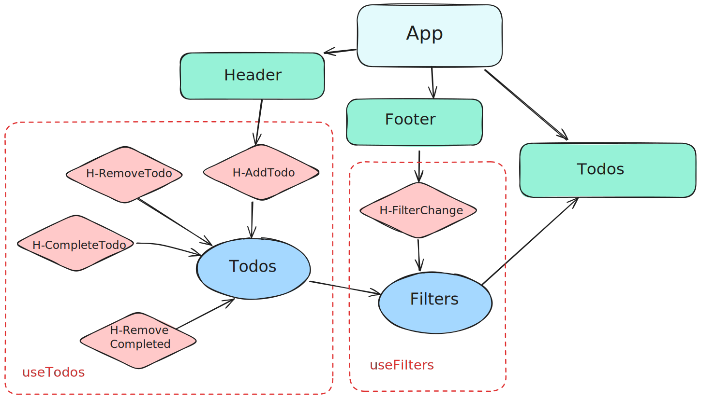

# Vite + React + TypeScript + Playwright

Daily tasks agenda empowered with custom hooks, typescript and local storage prevalence.

What to do with the "todos":

1 - By default you'll have 3 fictitious tasks as exaample.

2- You can complete the task or delete it

3- You can add new tasks writing it in the header input and Enter

4- You can filter the taks by their status

5- You can remove all the completed tasks

What we have here:

<ul>
<li>- Rect with Vite</li>
<li>- ToDo MVC css impplemented (and just that)</li>
<li>- Eslint</li>
<li>- Typescript</li>
<li>- Local storage manage hook</li>
<li>- e2e and integrational testing via Playwright </li>
</ul>

//--------------------------------------------------------////

<h5>Flowchart</h5>

